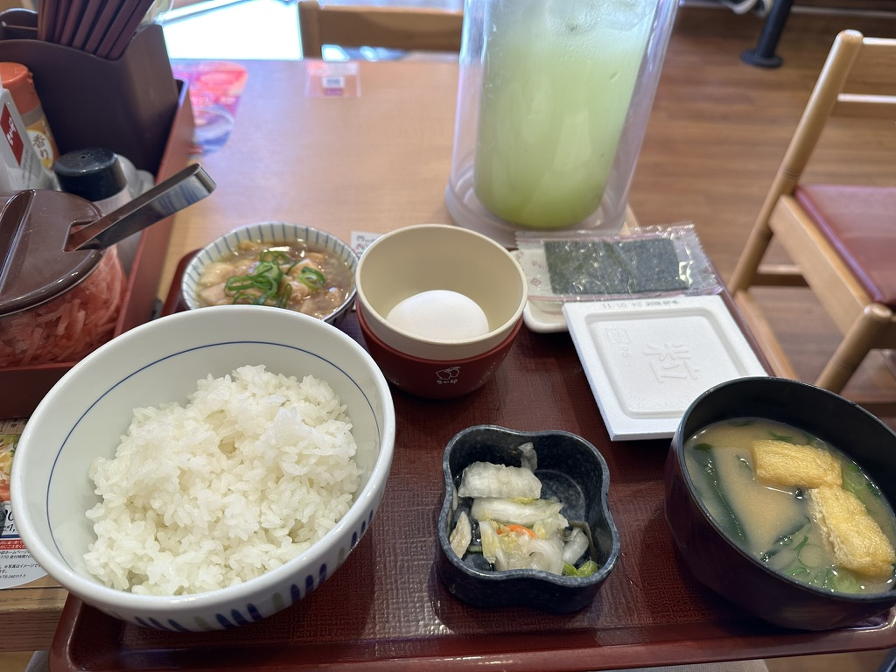
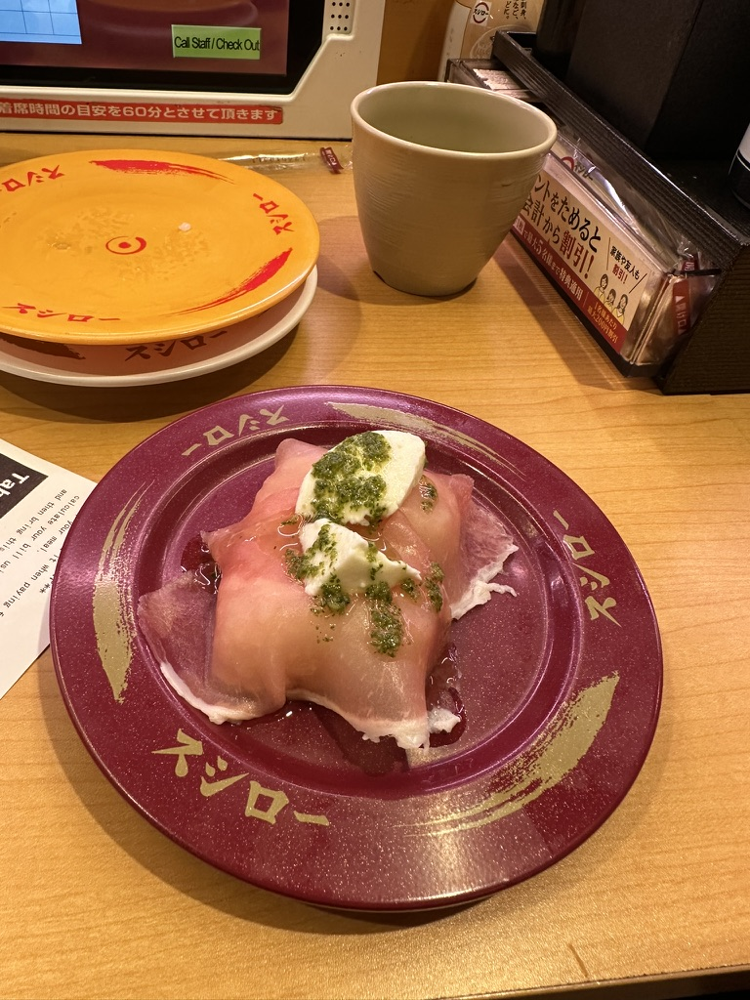
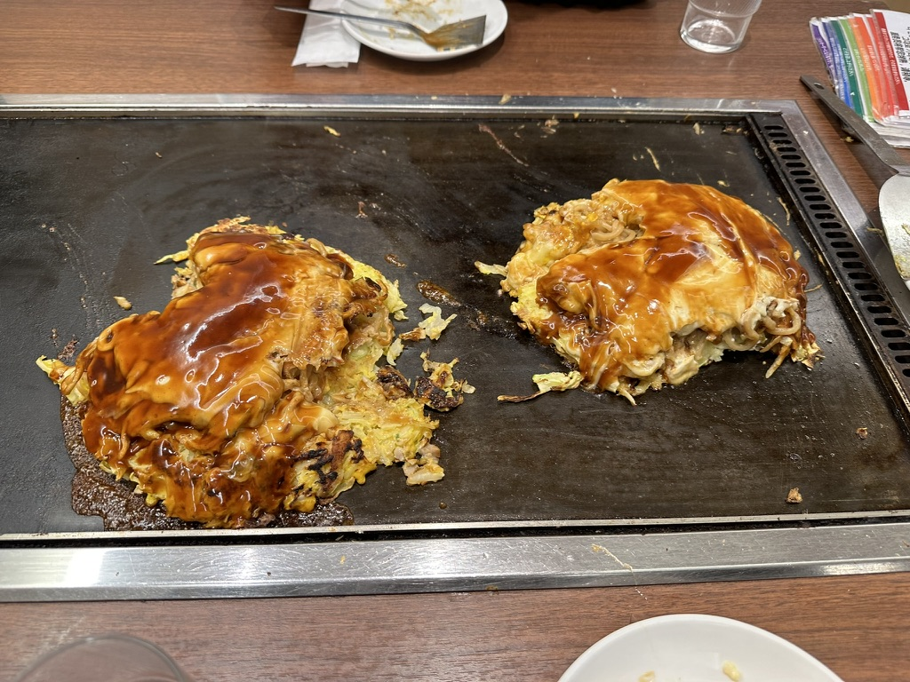
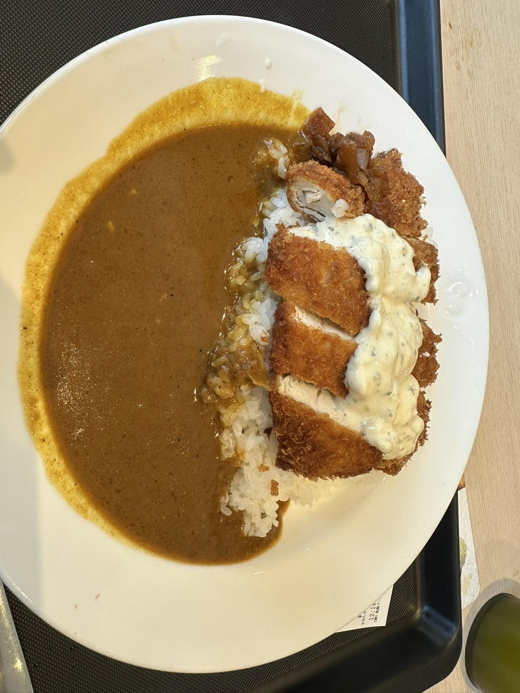
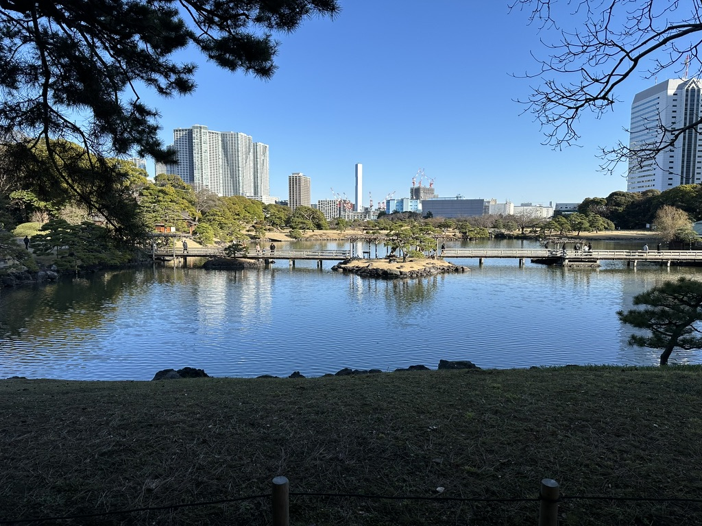
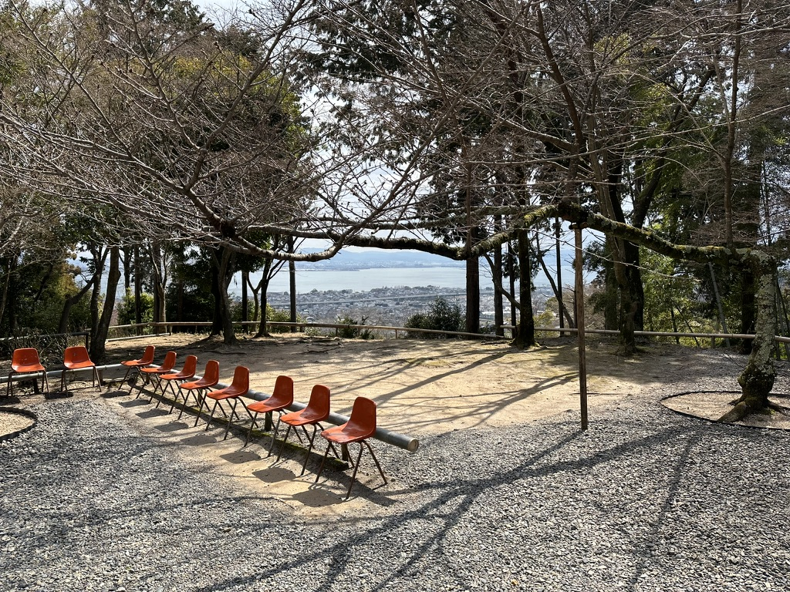
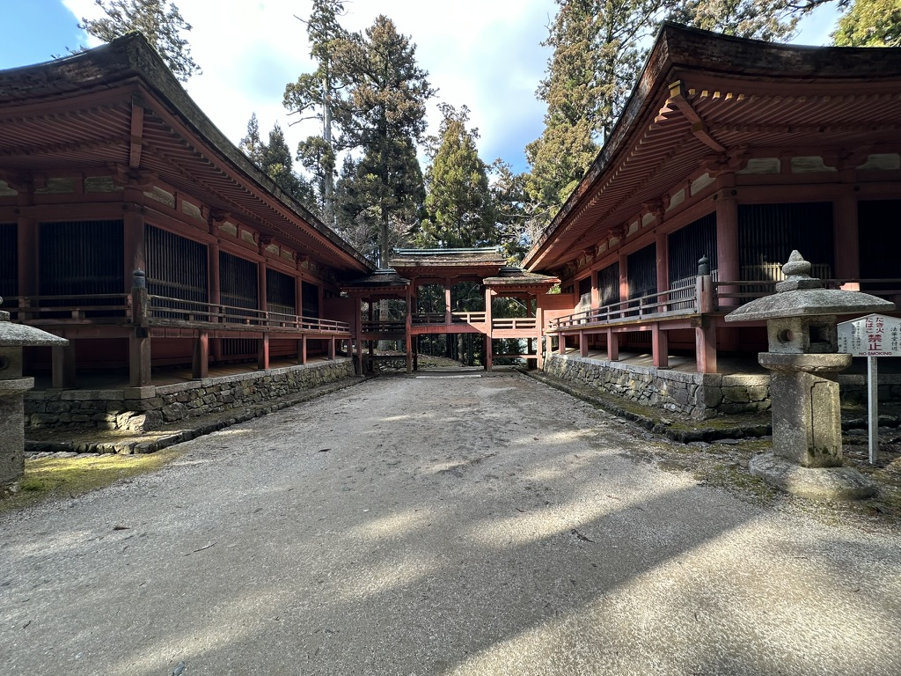
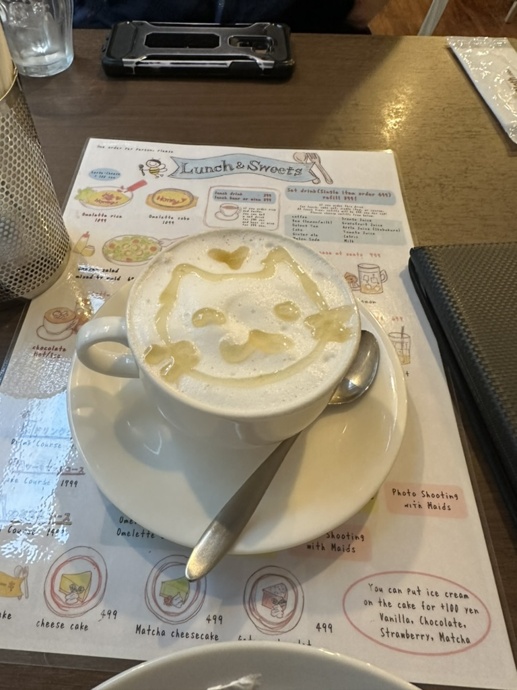

Here is my detailed guide to Japan. I hope you find it helpful! 

## Table of Contents

1. [Food](#Food)
2. [Places](#Places)

## Food

I would not mention the most popular dishes like sushi, ramen, or tempura. I would like to introduce you to some dishes that are not so popular, but still delicious.

1. The basic **Japanese breakfast**. Here I had rice, miso soup, raw egg, and some pickles. I think you are supposed to split the egg and put only the yolk in the rice. It's yummy in this way. Be careful for 'Natto' fermented soybeans. It's a bit smelly and sticky. You have to get used to eat, like you get used to coffee. You are supposed to eat it with rice.  

2. **Kaiten Sushi** There are a lot of options to eat them, but I highly recommend kaiten sushi. It's a sushi restaurant where sushi plates are placed on a rotating conveyor belt. Usually there is no only sushi, but also other dishes like ramen, tempura, and desserts. You can pick up the plate you want to eat. The price is determined by the color of the plate. Try to find maybe cheaper ones, where locals go, suited in basements.

Sushi with prosciutto and cheese. It's not traditional, but it's delicious.

3. **Okonomiyaki** It's a pancake with cabbage, meat, and other ingredients. Usually the chef cooks it in front of you. It's a bit heavy, but it's delicious. You can find it in Hiroshima and Osaka. There are different styles, deopending on the city. I would describe this as a Japanese pizza.

4. **Rice with chicken cutlet and curry** My favourite there. Pretty simple and self explanatory. It's a fried chicken cutlet with curry sauce and rice.

5. **Takoyaki** - the most popular street food (in my observation). It's a ball-shaped snack made of wheat flour and filled with minced or diced octopus. It's usually topped with takoyaki sauce, mayonnaise, aonori, and katsuobushi. 

6. **French bakery** - I know it's not Japanese, but I was surprised how many French bakeries are there. I recommend you to try some pastries. 

## Places & Activities

1. **Hamarikyū Gardens** - a large beautiful garder. In the middle of the garden there is a lake with a tea house. You can drink matcha tea there in traditional way.

2. **Traditional tea ceremony** 
Yeah, worth to try. It's a bit expensive, but it's a great experience. You can find some places where you can try it in Kyoto/Osaka.

3. **Mount Hiei** - It's a mountain to the northeast of Kyoto. It'f free hiking experience. You can see a beautiful view of Kyoto from the top. There are temples on the way. We enjoyed it more than Kyoto itself since it was less crowded.

4. **Maido Cafe** - It's a cafe where waitresses are dressed as maids. Yeah, there are different kinds of those cafe, some on them are more like a strip club, but other takes empathis on the nice service and being kind to the customers. It's a bit weird, but it's worth to try, especially if you are a fan of anime.

## Overall experience

We were at those 3 places - Tokyo, Kyoto, Osaka. In my opinion Tokyo was the most interesting, with a lot of things to do and suprisingly cheap. Then was Osaka, where it was less tourists oriented, but still interesting place. Kyoto has a lot to offer in terms of Tourist attractions and temples, but it was the most expensive and crowded.

I hope you will find my guide helpful. If you have any questions, feel free to ask me. I will be happy to help you. 

I am planning to go there for 3 months next year, starting from April. This time I want to see more places. The other german tourist highly recommended Hiroshima to visit. Mount Fuji is also on my list.